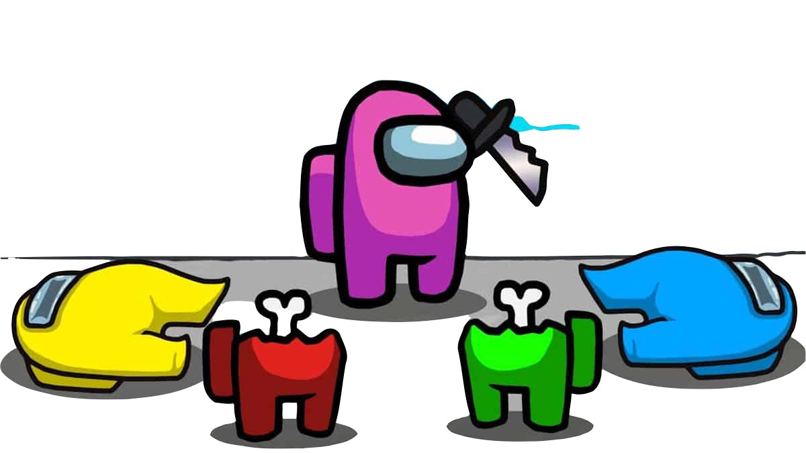
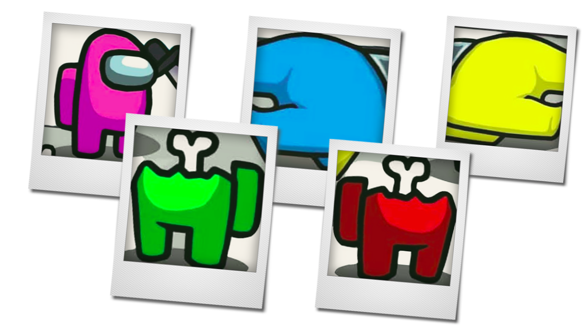

# Connected Component Analysis_Recognition-ComputerVision
- Objective :

  Perform connected component analysis to extract components and tag
  each component with a character that matches most features .
  Below are the operation performed at each step:
- Enrollment:

  All the components that are used to be the knowledge source in tagging the final output have been
  loaded. Features were extracted on each components and these features are read once and are stored
  in memory and will be used to match against the components and tag it to the component that
  resembles similar features.
Detection:

  On the test image, below are the step wise operation performed:
  o Threshold to convert images to binary, threshold used: 150
   Tested over wide range of thresholds and picked a value where there is not high
  change in number of components for small threshold change.
  o Performed self built connected component analysis algorithm and extracted components.
  Below picture illustrates how cases are handled at each pixel.

  On performing, first with label creation and second iteration on merging labels, finished
  extracting components from the image.
  Along with component labeling, created method to extract boundaries of a given
  component from the image.
  
- Example 1:
  
  Original image

Components:

  
- Recognition:
  Once we have components and its boundaries from detection, we perform feature extraction on
  each component and try to see if it matches with any of the characters knowledge set that we
  enrolled as step1. If features match we tag that component as that character if nothing match then
  tagged as ” unknown”.
